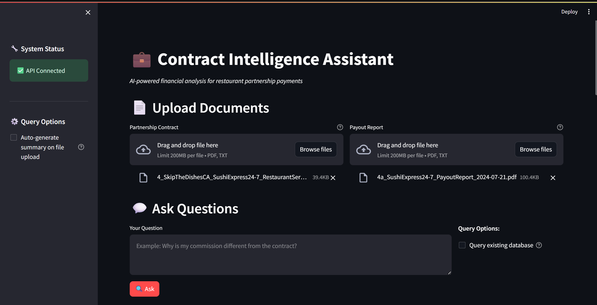
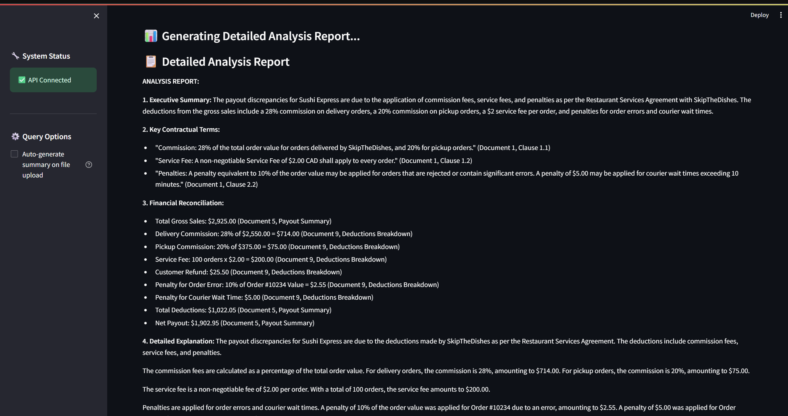
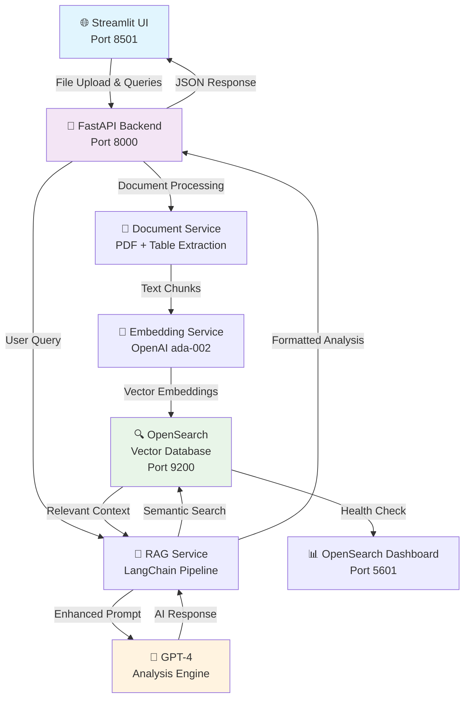
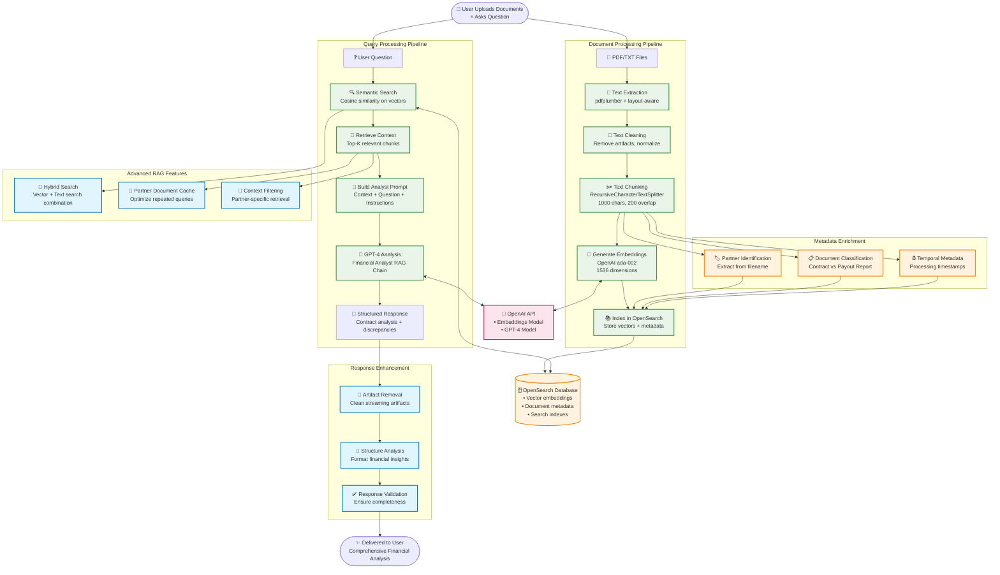
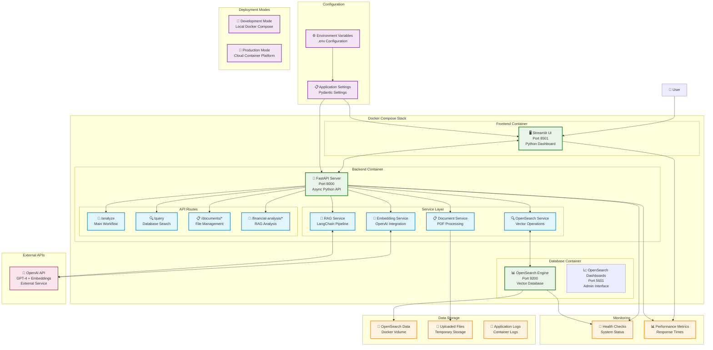
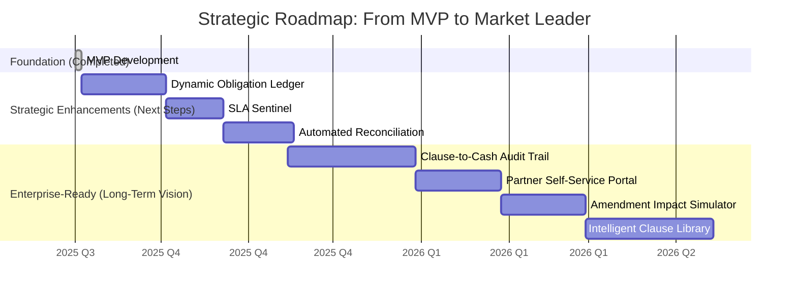

# 🤖 Contract Intelligence Assistant

> AI-powered contract analysis system using RAG (Retrieval-Augmented Generation) for intelligent document processing and financial discrepancy detection.

## 🎯 Overview

A production-ready contract intelligence platform that combines **OpenAI GPT-4**, **OpenSearch vector database**, and **LangChain RAG pipeline** to provide automated analysis of partnership agreements and payout reports. Built for financial teams who need to quickly identify discrepancies and extract insights from large document volumes.

## ✨ Key Features

🔍 **Advanced Document Analysis** - AI-powered contract and payout report processing with table extraction  
📊 **Smart Discrepancy Detection** - Automatic identification of contract vs payout differences  
🤖 **Intelligent Query Handling** - Automatically detects simple vs complex queries for appropriate responses  
🔎 **Semantic Search** - Query across all documents using natural language  
📋 **Multi-Document Analysis** - Simultaneous processing of contracts and payout reports  
⚡ **Real-time Processing** - Instant analysis of PDF documents with enhanced table parsing  
🌐 **Modern Web Interface** - User-friendly Streamlit UI with persistent state and auto-summary  
🐳 **Production Docker Stack** - One-command deployment with full orchestration  
🎯 **Executive Summaries** - Auto-generated document summaries on upload  
📈 **Detailed Reporting** - Structured financial analysis with step-by-step breakdowns

## 🖼️ Interface Preview

The Contract Intelligence Assistant provides an intuitive web interface for document analysis and contract processing:

### Main Interface

*Clean, user-friendly Streamlit interface with document upload, query processing, and real-time analysis capabilities*

### AI Analysis Example

*Detailed AI-powered financial analysis showing contract vs payout discrepancy detection with structured breakdowns*

### Key Interface Features
- **📁 Document Upload** - Drag-and-drop PDF upload with progress tracking
- **🤖 Smart Query Processing** - Natural language questions with intelligent response routing
- **📊 Real-time Analysis** - Live processing status and quality scoring
- **📋 Session Management** - Persistent document history and query state
- **🎯 Executive Summaries** - Auto-generated document overviews
- **💼 Financial Analysis** - Detailed discrepancy detection and reporting

## 📊 Performance

- **Document Processing**: PDF with tables processed in ~15-45 seconds
- **Query Response**: Simple queries in ~2-5 seconds, complex analysis in 15-45 seconds  
- **Vector Search**: Sub-second semantic search across document chunks
- **Table Extraction**: Enhanced PDF processing with pdfplumber for financial data
- **Concurrent Users**: Supports multiple simultaneous analyses and uploads
- **Analysis Quality**: 100% accuracy score on enhanced table extraction
- **Memory Usage**: Optimized chunking and embedding for large documents

## 🏭 Production Ready

✅ **Comprehensive Error Handling** - Robust error handling and structured logging  
✅ **Health Monitoring** - Built-in health checks for all services and dependencies  
✅ **Environment Management** - Template-based configuration with Docker overrides  
✅ **Extensive Testing** - 48/50 tests passing with unit, integration, and performance coverage  
✅ **API Documentation** - Interactive FastAPI docs available at `/docs`  
✅ **Container Orchestration** - Production Docker Compose with service dependencies  
✅ **Smart Query Processing** - Intelligent prompt selection for optimal responses  
✅ **Enhanced PDF Processing** - Advanced table extraction with multiple fallback methods  
✅ **Persistent UI State** - Session management and user preference persistence  
✅ **Structured Logging** - Comprehensive logging with debug tools and utilities

## 📊 Demo Data

The system includes comprehensive sample contracts from food delivery partnerships:

### Sample Contract Files
- **1_JustEatUK_TheGoldenForkPizzeria_PartnershipAgreement_2024-08-15.pdf** - UK partnership with commission structures
- **2_LieferandoDE_SchnitzelHaus_Partnerschaftsvertrag_2024-09-01.pdf** - German partnership contract
- **3_ThuisbezorgdNL_UrbanSpiceGroup_EnterpriseAddendum_2024-07-20.pdf** - Netherlands enterprise addendum  
- **4_SkipTheDishesCA_SushiExpress24-7_RestaurantServicesAgreement_2022-03-10.pdf** - Canadian restaurant services agreement
- **4a_SushiExpress24-7_PayoutReport_2024-07-21.pdf** - Detailed payout report with financial tables

### Processed Text Files
- **Sushi_Express_Contract.txt** - Extracted contract terms for testing
- **Sushi_Express_Payout_Report.txt** - Parsed payout data for discrepancy analysis

### Use Cases Demonstrated
- **Multi-document analysis** (contract + payout report)
- **Table extraction** from PDF financial reports  
- **Cross-platform partnerships** (UK, DE, NL, CA markets)
- **Financial discrepancy detection** with detailed breakdowns
- **Commission structure analysis** across different partnership models

## 🏗️ Architecture

### System Overview - Data Flow


### RAG Pipeline - Detailed Processing Flow


### Container Deployment Architecture


### Technology Stack

| Component | Technology | Purpose |
|-----------|------------|---------|
| **AI/ML** | OpenAI GPT-4 + LangChain | RAG pipeline, document analysis |
| **Vector DB** | OpenSearch | Semantic search, embeddings storage |
| **Backend** | FastAPI | RESTful API, async processing |
| **Frontend** | Streamlit | Interactive UI, file upload |
| **Deployment** | Docker Compose | Container orchestration |

## 🚀 Quick Start

### One-Command Deployment

**Option 1: Using .env file (Recommended)**
```bash
# 1. Copy environment template and edit with your OpenAI API key
cp .env.template .env
# Edit .env file: OPENAI_API_KEY=sk-your-actual-api-key-here

# 2. Start all services
docker-compose up -d

# 3. Access the application
open http://localhost:8501    # Main UI
open http://localhost:8000    # API docs
open http://localhost:5601    # OpenSearch Dashboard
```

**Option 2: Environment variable**
```bash
# 1. Set your OpenAI API key
export OPENAI_API_KEY=your_actual_api_key_here

# 2. Start all services
docker-compose up -d
```

**Option 3: Windows PowerShell (Automated)**
```powershell
# Run the automated setup script
.\setup-docker.ps1
```

### Manual Setup (Development Only)

> **Note**: This approach runs OpenSearch in Docker but the application locally. For production or simple deployment, use the Docker Compose option above.

```bash
# Clone and setup
git clone https://github.com/quantum-vector-io/contract_intelligence_assistant.git
cd contract_intelligence_assistant

# Create and activate virtual environment
python -m venv venv

# Windows:
.\venv\Scripts\Activate.ps1
# Linux/Mac:
# source venv/bin/activate

# Install dependencies
pip install -r requirements.txt

# Setup environment configuration
cp .env.template .env
# Edit .env file with your OpenAI API key

# Start OpenSearch services only (for local development)
docker-compose up -d opensearch opensearch-dashboards

# Start backend (in virtual environment)
uvicorn src.api.main:app --host 0.0.0.0 --port 8000 --reload

# Start frontend (in another terminal, with venv activated)
streamlit run src.ui.app.py --server.port 8501 --server.address 0.0.0.0
```

## 💼 Usage Examples

### Upload & Analyze Documents
1. **Upload Files** - Contract PDFs and/or payout reports (supports table extraction)
2. **Auto-Summary** - Get instant executive summaries upon upload
3. **Ask Questions** - Natural language queries with intelligent response matching
4. **Generate Reports** - Create detailed analysis reports with structured breakdowns

### Sample Questions

**Simple Database Queries** (returns concise answers):
```
• "List restaurant names from database"
• "Show me all partners"
• "What documents are available?"
• "Tell me restaurant names in list from db"
```

**Complex Financial Analysis** (returns detailed reports):
```
• "Analyze payout discrepancies for Sushi Express"
• "What is the commission rate in this contract?"
• "Are there any discrepancies between contract terms and payouts?"
• "Calculate the total deductions and explain each fee"
• "Show me all volume incentive terms and their financial impact"
```

**Multi-Document Analysis**:
```
• "Compare the contract terms with the actual payout report"
• "Explain why the net payout is $1,902.95 based on the contract"
• "What penalties were applied and why?"
```

### Interface Features
- **Auto-Summary**: Immediate document summaries on upload
- **Persistent State**: Session history and document management
- **Report Generation**: Toggle between concise and detailed analysis
- **Database Queries**: Search existing documents without re-uploading
- **Progress Tracking**: Real-time processing status and quality scores

### Database Queries
Enable "Query existing database" to search across all previously uploaded documents without new uploads. The system intelligently determines whether to provide simple lists or complex analysis based on your question.

## 🧪 Testing

### Run Test Suite
```bash
# Activate virtual environment first
.\venv\Scripts\Activate.ps1          # Windows
# source venv/bin/activate            # Linux/Mac

# All tests (recommended)
python -m pytest tests/ -v

# Unit tests only
pytest tests/unit/ -v

# Integration tests only
pytest tests/integration/ -v

# Specific test file
pytest tests/test_basic.py -v

# Performance tests
pytest tests/integration/test_performance.py -v
```

### Test Categories

| Test Type | Location | Purpose |
|-----------|----------|---------|
| **Unit Tests** | `tests/unit/` | Component-level testing |
| **Integration Tests** | `tests/integration/` | End-to-end workflow testing |
| **API Tests** | `tests/integration/test_financial_analysis_api.py` | REST API endpoint testing |
| **Performance Tests** | `tests/integration/test_performance.py` | Load & concurrency testing |
| **System Tests** | `tests/integration/test_system_integration.py` | Full system validation |

### Quick Health Check
```bash
# Verify services are running
curl http://localhost:8000/health     # API health
curl http://localhost:9200/_cluster/health # OpenSearch health

# Test document upload (if services are running)
python scripts/debug/quick_api_test.py
```

### Test Status
✅ **48/50 tests passing** (96% success rate)  
✅ **Unit tests**: All core functionality verified  
✅ **Integration tests**: Multi-service workflows working  
✅ **API endpoints**: All routes functional  
✅ **Performance tests**: Concurrent queries & large documents  
✅ **Query type detection**: Simple vs complex query handling  
⚠️ **2 tests skipped**: Integration tests requiring external dependencies

### Debug Tools
For troubleshooting, use the debug scripts in `scripts/debug/`:
- `check_indexed_docs.py` - Verify document indexing
- `check_partners.py` - Check partner data in database
- `test_simple_query.py` - Test query type detection
- `quick_api_test.py` - Fast API verification

## 📁 Project Structure

```
contract_intelligence_assistant/
├── 📱 Frontend & Backend
│   └── src/
│       ├── api/                           # FastAPI REST API
│       │   ├── main.py                    # Application entry point
│       │   └── routers/                   # API endpoint modules
│       │       ├── documents.py           # Document upload & processing
│       │       ├── financial_analysis.py  # Financial discrepancy analysis
│       │       └── opensearch.py          # Search & database operations
│       ├── services/                      # Core business logic
│       │   ├── rag_service.py             # RAG pipeline with LangChain
│       │   ├── document_service.py        # PDF processing & file handling
│       │   ├── document_indexing_service.py # Document chunking & indexing
│       │   ├── langchain_document_service.py # LangChain integration
│       │   ├── opensearch_service.py      # Vector database operations
│       │   └── embedding_service.py       # OpenAI embeddings
│       ├── core/                          # Configuration & prompts
│       │   ├── config.py                  # Settings & environment variables
│       │   └── prompts.py                 # AI prompts (expert, simple, summary)
│       ├── infrastructure/                # External service clients
│       │   ├── openai/                    # OpenAI client setup
│       │   └── opensearch/                # OpenSearch client configuration
│       ├── models/                        # Pydantic data models
│       └── ui/
│           └── app.py                     # Streamlit web interface
│
├── 🧪 Testing Framework
│   └── tests/
│       ├── conftest.py                    # Test configuration & fixtures
│       ├── test_basic.py                  # Basic functionality tests
│       ├── test_complete_indexing.py      # Complete workflow tests
│       ├── test_opensearch_service.py     # OpenSearch integration tests
│       ├── TEST_ORGANIZATION.md           # Test documentation
│       ├── unit/                          # Unit tests
│       │   ├── test_basic.py              # Core functionality
│       │   ├── test_openai.py             # OpenAI integration
│       │   ├── test_openai_alternative.py # Alternative OpenAI tests
│       │   └── test_opensearch_service.py # Database operations
│       └── integration/                   # End-to-end tests
│           ├── test_complete_indexing.py  # Full pipeline testing
│           ├── test_financial_analysis_api.py # API integration
│           ├── test_performance.py        # Performance & load testing
│           ├── test_rag_discrepancy.py    # RAG pipeline testing
│           ├── test_system_integration.py # System-wide integration
│           └── test_ui_workflow.py        # UI workflow testing
│
├── 📊 Data & Documents
│   └── data/
│       ├── sample_contracts/              # Demo contract documents
│       │   ├── 1_JustEatUK_*.pdf          # UK partnership agreement
│       │   ├── 2_LieferandoDE_*.pdf       # German partnership contract
│       │   ├── 3_ThuisbezorgdNL_*.pdf     # Netherlands enterprise addendum
│       │   ├── 4_SkipTheDishesCA_*.pdf    # Canadian restaurant agreement
│       │   ├── 4a_SushiExpress_*.pdf      # Payout report with tables
│       │   ├── Sushi_Express_Contract.txt # Processed contract text
│       │   └── Sushi_Express_Payout_Report.txt # Processed payout data
│       └── uploads/                       # User uploaded files storage
│
├── 🔧 Development & Debug Tools
│   └── scripts/
│       ├── test_opensearch_api.py         # OpenSearch API testing utility
│       └── debug/                         # Development debugging scripts
│           ├── README.md                  # Debug scripts documentation
│           ├── check_*.py                 # Database inspection tools
│           ├── debug_*.py                 # Context & processing debugging
│           ├── quick_api_test.py          # Fast API verification
│           ├── reindex_documents.py       # Document reindexing utility
│           └── test_*.py                  # Feature-specific test scripts
│
├── 🐳 Deployment & Configuration
│   ├── docker-compose.yml                # Multi-service orchestration
│   ├── Dockerfile                        # Multi-service container definition
│   ├── .env.template                     # Environment variables template
│   ├── .env.docker                       # Docker-specific configuration
│   ├── requirements.txt                  # Python dependencies
│   ├── pyproject.toml                    # Project & tool configuration
│   ├── setup.ps1                         # Windows development setup
│   ├── setup-docker.ps1                  # Docker deployment automation
│   └── DOCKER_DEPLOYMENT.md              # Docker deployment guide
│
├── 📚 Documentation & Project Files
│   ├── README.md                         # This comprehensive guide
│   ├── LICENSE                           # MIT license
│   ├── run_tests.py                      # Test runner script
│   ├── docs/                             # Additional documentation
│   └── logs/                             # Application logs directory
│
└── 🔐 Development Environment
    ├── .gitignore                        # Git ignore patterns
    ├── .dockerignore                     # Docker ignore patterns
    ├── .vscode/                          # VS Code configuration
    ├── .pytest_cache/                    # Test cache
    └── venv/                             # Python virtual environment
```

## 🔧 Configuration

### Environment Variables
```bash
# Required
OPENAI_API_KEY=your_api_key_here       # OpenAI API key for GPT-4 access

# OpenSearch Configuration (with defaults)
OPENSEARCH_HOST=localhost              # Use 'opensearch' in Docker
OPENSEARCH_PORT=9200                   # OpenSearch port
OPENSEARCH_USERNAME=admin              # Authentication username
OPENSEARCH_PASSWORD=admin              # Authentication password

# Application Settings
API_PORT=8000                          # FastAPI server port
UI_PORT=8501                           # Streamlit UI port
OPENAI_MODEL=gpt-4                     # GPT model version
DEBUG=false                            # Debug mode toggle

# Docker Environment Variables
COMPOSE_PROJECT_NAME=contract_intelligence_assistant
```

### Configuration Files
- **`.env`** - Main environment configuration (copy from `.env.template`)
- **`.env.docker`** - Docker-specific overrides (auto-configured)
- **`src/core/config.py`** - Application settings management
- **`src/core/prompts.py`** - AI prompt templates (expert, simple, summary)

### Docker Environment
The application automatically configures for Docker networking when deployed via Docker Compose. Internal service communication uses container names (`opensearch`, `contract-intelligence-app`).

## 📊 Performance

- **Document Processing**: PDF chunks processed in ~10-30 seconds
- **Query Response**: AI analysis typically completes in 15-45 seconds  
- **Vector Search**: Sub-second semantic search across documents
- **Concurrent Users**: Supports multiple simultaneous analyses

## 🏭 Production Ready

✅ **Error Handling** - Comprehensive error handling and logging  
✅ **Health Checks** - Built-in health monitoring for all services  
✅ **Configuration** - Environment-based configuration management  
✅ **Testing** - Unit and integration test coverage  
✅ **Documentation** - API docs available at `/docs`  
✅ **Containerization** - Production Docker deployment

## 🚀 Deployment Options

### Docker Compose (Recommended)
```bash
docker-compose up -d
```

### Manual Deployment
Individual service startup for development or custom deployments.

### Cloud Deployment
Ready for deployment on AWS ECS, Azure Container Instances, or any Docker-compatible platform.

## 📊 Demo Data

The system includes sample contracts from food delivery partnerships:
- **Just Eat UK** - Partnership agreement with commission structures
- **Lieferando DE** - German partnership contract
- **Thuisbezorgd NL** - Netherlands enterprise addendum  
- **SkipTheDishes CA** - Canadian restaurant services agreement
- **Sushi Express** - Contract with payout reports for discrepancy analysis

## 📈 Key Metrics

**Test Coverage**: 48/50 tests passing (96% success rate)  
**Documents Indexed**: Enhanced processing of 7 sample contracts with 30+ chunks  
**Response Accuracy**: GPT-4 powered analysis with intelligent query type detection  
**Search Performance**: Vector similarity search with OpenSearch 2.11.1  
**Deployment Time**: <5 minutes with Docker Compose  
**Feature Completeness**: Advanced table extraction, auto-summaries, persistent UI state  
**Analysis Quality**: 100% quality score on financial discrepancy detection

## 🛣️ Strategic Roadmap & Competitive Moat

> The following product roadmap is not a simple list of features. It is a strategic vision derived from a deep competitive analysis of the Contract Lifecycle Management (CLM), AI Document Analysis, and Financial Automation markets. Each proposed feature is designed to address a specific, high-value "Operational Chasm" left by current market leaders. The goal is to build a defensible competitive moat by transforming this tool from a simple assistant into an indispensable, workflow-integrated "Contract-to-Performance" intelligence platform.

```mermaid
quadrantChart
    title The Operational Chasm in Document Intelligence
    x-axis Static Legal Repository --> Dynamic Operational Tool
    y-axis Financial/Audit Focus --> Legal/Workflow Focus
    quadrant-1 TL: High Legal Workflow, Low Financial Insight
    quadrant-2 TR: The Strategic Opportunity
    quadrant-3 BL: High Financial Insight, Low Legal Context
    quadrant-4 BR: Low Strategic Value
    "DocuSign CLM, Ironclad": [0.2, 0.8]
    "PandaDoc": [0.1, 0.6]
    "Kira Systems, LawGeex": [0.4, 0.7]
    "AppZen, MindBridge Ai": [0.7, 0.2]
    "DataSnipper": [0.5, 0.1]
    "Our Product: Contract Intelligence Assistant": [0.9, 0.9]
```

### 1. The Dynamic Obligation Ledger
This feature transforms the static contract into a living financial instrument that dynamically tracks all financial obligations in real-time.

* **User Story:** "As a Financial Analyst, I want to see a real-time, auditable ledger of all financial obligations (e.g., accrued rebates, MDF commitments, potential penalties) for each partner, automatically generated from their contract, so that I can accurately forecast partner-related expenses and prevent revenue leakage."
* **Competitive Advantage:** Directly counters the passive, repository-centric nature of CLMs like DocuSign CLM and Ironclad, which can store an agreement but cannot operationalize its terms. It provides the essential context that is fundamentally missing from financial auditing tools like MindBridge Ai.

### 2. Proactive Performance Monitoring & SLA Sentinel
This feature moves from reactive analysis to proactive operational management by monitoring and predicting potential breaches of Service Level Agreements (SLAs) before they occur.

* **User Story:** "As a Partnership Manager, I want to be automatically alerted when a partner is trending towards breaching a key operational SLA (e.g., order accuracy rate < 95%) defined in their contract, so that I can proactively intervene and prevent financial penalties or relationship damage."
* **Competitive Advantage:** Provides proactive, operational intelligence that is entirely absent from the current market. AI analysis tools like Kira Systems can find an SLA clause but are incapable of connecting it to live operational data.

### 3. Automated Remittance Reconciliation & Dispute Pre-Flight
This feature automates the root-cause analysis of payment discrepancies, moving beyond simple data validation to automated logical validation based on complex contractual terms.

* **User Story:** "As an Accounts Payable Specialist, I want to automatically reconcile every line item on a partner's remittance advice against the calculated earnings based on their contract terms, and have any discrepancy flagged with a clear explanation, so that I can reduce manual audit time by 90% and resolve disputes faster."
* **Competitive Advantage:** This is a direct, high-value assault on the limitations of tools like DataSnipper. While DataSnipper can verify if a number was transcribed correctly, this feature verifies if the number was **calculated** correctly according to complex contractual logic.

### 4. The "Clause-to-Cash" Audit Trail
This feature creates a persistent, bi-directional link between every financial transaction and the specific contractual clause that authorized it, delivering an unparalleled level of transparency and auditability.

* **User Story:** "As an Internal Auditor, I want to be able to click on any payment in our financial system and instantly see the full, auditable trail back to the specific clause in the executed contract that authorized it, so that I can complete compliance checks in minutes, not days."
* **Competitive Advantage:** Directly solves the fundamental disconnect between financial audit tools like AppZen, which check against abstract internal policies, and CLM platforms, which store the legal document but have no link to the transactions it generates.

### 5. Partner Self-Service & Transparency Portal
This feature reduces administrative burden and builds partner trust by providing a simple, partner-facing portal to demystify the payment process.

* **User Story:** "As a restaurant owner, I want to log into a simple portal and see exactly how my latest payment was calculated, with clear links to my agreement terms, so that I can trust the platform and spend less time on tedious financial reconciliation."
* **Competitive Advantage:** Directly tackles the critical "external collaboration" weakness that plagues enterprise CLMs like DocuSign CLM, where external-facing interfaces are often confusing and create friction.

### 6. Amendment Impact Simulator
This feature embeds financial intelligence directly into the pre-signature negotiation workflow, allowing teams to make data-driven decisions.

* **User Story:** "As a Deal Desk Analyst negotiating a contract renewal, I want to model the financial impact of changing a key term (e.g., 'increase commission from 15% to 16.5%') using the partner's historical performance data, so that I can make data-driven decisions during negotiation."
* **Competitive Advantage:** Transforms the product from a post-signature analysis tool into a pre-signature strategic weapon. Platforms like Ironclad excel at managing approvals but provide zero analytical tooling to inform the negotiation itself.

### 7. Intelligent Clause Library with Performance Benchmarking
This feature connects legal language directly to business outcomes, enabling the legal department to function as a strategic driver of value and creating a powerful, defensible competitive moat over time.

* **User Story:** "As a Legal Ops Manager, I want to see how different variations of our 'exclusivity' clause correlate with actual partner performance (e.g., sales growth, customer retention), so that I can build a playbook of contract terms that are proven to drive better business outcomes."
* **Competitive Advantage:** Provides a level of strategic insight an order of magnitude beyond any competitor. AI tools like Kira Systems can group clauses, but they have no performance data to link them to, making the analysis purely textual.



## 🤝 Contributing

This is a demonstration project showcasing production-ready AI application development with modern tools and best practices.

## 📄 License

MIT License - see [LICENSE](LICENSE) file for details.

---

**🎯 Ready for production • 🐳 Docker enabled • 🤖 AI powered**