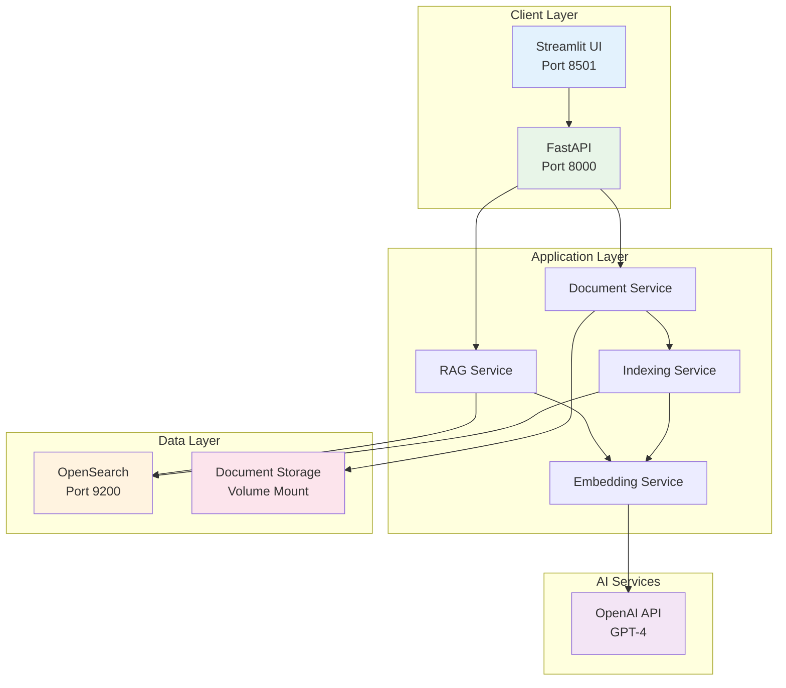

# Deployment Architecture

This document describes the deployment architecture for the Contract Intelligence Assistant system.

## System Deployment Overview

## Deployment Components

### Frontend Services
- **Streamlit UI**: Interactive web interface on port 8501
- **FastAPI**: REST API backend on port 8000

### Core Services
- **Document Service**: Handles PDF processing and text extraction
- **RAG Service**: Manages query processing and response generation
- **Embedding Service**: Creates and manages document embeddings
- **Indexing Service**: Manages document indexing in OpenSearch

### External Dependencies
- **OpenAI API**: GPT-4 for natural language processing
- **OpenSearch**: Vector database and search engine on port 9200

### Data Persistence
- **Document Storage**: Volume-mounted directory for contract files
- **Vector Index**: Persistent OpenSearch indexes

## Docker Configuration

### Service Definitions
- **app**: Main application container with FastAPI and Streamlit
- **opensearch**: OpenSearch container with custom configuration
- **Volume Mounts**: Local data directory for document persistence

### Network Configuration
- **Internal Network**: Services communicate via Docker internal network
- **Port Mapping**: Exposed ports for external access
- **Health Checks**: Automated service health monitoring

## Scalability Considerations

1. **Horizontal Scaling**: Can be deployed across multiple containers
2. **Load Balancing**: FastAPI supports multiple worker processes
3. **Database Sharding**: OpenSearch can be clustered for larger datasets
4. **Caching Layer**: Response caching can be added for improved performance

## Security Features

- **API Authentication**: Can be extended with JWT tokens
- **Network Isolation**: Docker internal network for service communication
- **Data Encryption**: HTTPS support for external connections
- **Environment Variables**: Secure configuration management
