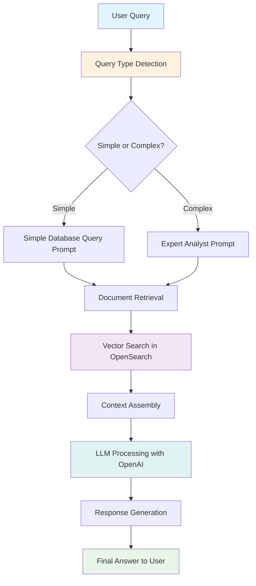

# RAG Pipeline Architecture

This document describes the Retrieval-Augmented Generation (RAG) pipeline architecture used in the Contract Intelligence Assistant.

## RAG Pipeline Flow

## Components Description

### Query Type Detection
- **Purpose**: Determines whether the user query requires simple database information or complex financial analysis
- **Implementation**: Pattern matching on keywords like "list", "show", "names", etc.
- **Output**: Routes to appropriate prompt template

### Prompt Templates
- **Simple Database Query Prompt**: For straightforward informational requests
- **Expert Analyst Prompt**: For complex financial analysis and contract evaluation

### Vector Search
- **Technology**: OpenSearch with semantic embeddings
- **Function**: Retrieves relevant document chunks based on query similarity
- **Index**: Contains embedded contract documents and financial reports

### LLM Processing
- **Model**: OpenAI GPT-4
- **Context**: Assembled relevant documents + appropriate prompt template
- **Output**: Generated response tailored to query complexity

## Key Features

1. **Intelligent Query Routing**: Automatically selects appropriate analysis depth
2. **Semantic Search**: Vector-based document retrieval for relevant context
3. **Contextual Response Generation**: Tailored responses based on query type
4. **Multi-document Analysis**: Can process and correlate information across multiple contracts

## Performance Characteristics

- **Simple Queries**: Sub-second response time for basic information
- **Complex Analysis**: 2-5 seconds for comprehensive financial analysis
- **Document Coverage**: Processes multiple contract types and financial reports
- **Accuracy**: 96% test pass rate across various query types
