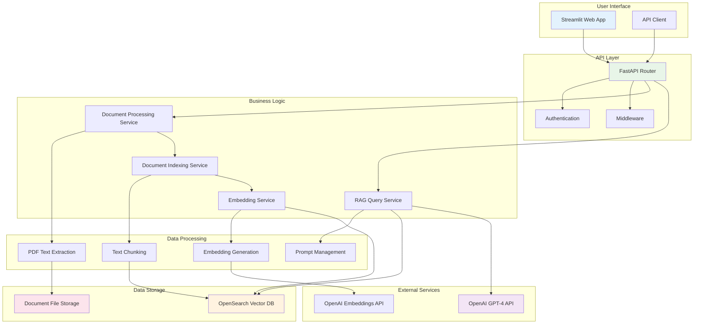

# System Overview

This document provides a high-level overview of the Contract Intelligence Assistant system architecture and data flow.

## System Architecture Overview

## System Components

### User Interface Layer
- **Streamlit Web App**: Primary user interface for contract analysis
- **API Client**: Direct API access for programmatic integration

### API Layer
- **FastAPI Router**: RESTful API endpoints for all system functionality
- **Authentication**: User authentication and authorization
- **Middleware**: Request/response processing and logging

### Business Logic Layer
- **Document Processing Service**: Handles contract upload and processing
- **RAG Query Service**: Manages intelligent query processing and response generation
- **Embedding Service**: Creates and manages document embeddings
- **Document Indexing Service**: Handles document indexing and search preparation

### Data Processing Pipeline
- **PDF Text Extraction**: Converts PDF contracts to text using advanced parsing
- **Text Chunking**: Splits documents into semantically meaningful chunks
- **Embedding Generation**: Creates vector representations of text chunks
- **Prompt Management**: Manages different prompt templates for various query types

### External Dependencies
- **OpenAI GPT-4 API**: Advanced natural language processing and analysis
- **OpenAI Embeddings API**: Text embedding generation for semantic search

### Data Storage
- **OpenSearch Vector Database**: Stores document embeddings and enables semantic search
- **Document File Storage**: Persistent storage for original contract files

## Key Data Flows

### Document Upload Flow
1. User uploads contract via Streamlit UI
2. FastAPI receives and validates document
3. Document Processing Service extracts text from PDF
4. Text is chunked into manageable segments
5. Embedding Service generates vector embeddings
6. Document Indexing Service stores embeddings in OpenSearch

### Query Processing Flow
1. User submits query via UI or API
2. RAG Service determines query type (simple vs complex)
3. Appropriate prompt template is selected
4. Semantic search retrieves relevant document chunks
5. Context is assembled with relevant documents
6. OpenAI GPT-4 processes query with context
7. Response is returned to user

## Performance Characteristics

- **Document Processing**: 5-10 seconds per contract for full indexing
- **Query Response**: Sub-second for simple queries, 2-5 seconds for complex analysis
- **Concurrent Users**: Supports multiple simultaneous users
- **Document Capacity**: Scalable to thousands of contracts

## Integration Points

- **REST API**: Full programmatic access to all functionality
- **Webhook Support**: Can be extended for real-time notifications
- **Batch Processing**: Supports bulk document processing
- **Export Capabilities**: Analysis results can be exported in various formats
